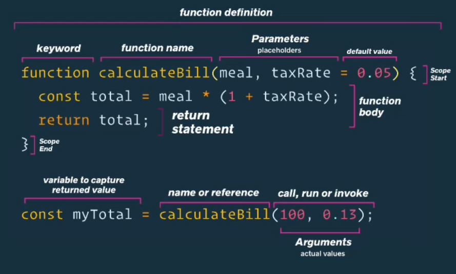

## Introduction to Functions in JavaScript

Functions are fundamental building blocks in web development, enabling developers to organize code, reuse logic, and create dynamic interactions within web applications. From the simplest tasks to complex operations, functions play a pivotal role in JavaScript programming.

In the most basic meaning a JavaScript function is a block of code designed to perform a particular task. A JavaScript function is executed when "something" invokes it (calls it).

Function values are typically instances of **Function** object. Callable values cause **typeof** to return "function" instead of "object". The **Function** object provides methods for functions. In JavaScript, every function is actually a **Function** object. More can be learned abut in the [MDN Web Docs\_](https://developer.mozilla.org/en-US/docs/Web/JavaScript/Reference/Global_Objects/Function).

### JavaScript Function Syntax

A JavaScript function is defined with the **function** keyword, followed by a **name**, followed by parentheses ().

Function names can contain letters, digits, underscores, and dollar signs (same rules as variables).

The parentheses may include parameter names separated by commas:
(parameter1, parameter2, ...)

The code to be executed, by the function, is placed inside curly brackets: {}

```js
function name(parameter1, parameter2, parameter3) {
    // code to be executed
}
```

Function **parameters** are listed inside the parentheses () in the function definition.

Function **arguments** are the values received by the function when it is invoked.

Inside the function, the arguments (the parameters) behave as local variables.



## Function Definitions

In JavaScript, a function definition is a fundamental concept that defines a reusable block of code designed to perform a specific task. Function definitions in JavaScript can take various forms, each serving different purposes and use cases. Broadly speaking, JavaScript has four kinds of functions:

-   **Regular function**: can return anything; always runs to completion after invocation
-   **Generator function**: Generator functions are special functions return a Generator object, can be paused and resumed with the yield operator.
-   **Async function**: returns a Promise; can be paused and resumed with the await operator
-   **Async generator function**: returns an AsyncGenerator object; both the await and yield operators can be used

For every kind of function, there are three ways to define it:

1. **Declaration**
   A function declaration is a statement that defines a named function using the "function" keyword followed by the function name, parameters, and function body enclosed in curly braces. It is hoisted to the top of its scope, allowing it to be called before its actual declaration within the code.

2. **Expression**
   A function expression is a way to define a function as part of an expression, typically by assigning it to a variable. It doesn't get hoisted like function declarations, so it can only be called after its definition. Function expressions can be named or anonymous.

3. **Constructor**
   The function constructor is a built-in JavaScript function used to create new functions dynamically at runtime. It takes arguments representing the function parameters and the function body as strings. While it provides flexibility, using the function constructor is less common and can introduce security risks if not used carefully due to the potential for injection attacks.

    In addition, there are special syntaxes for defining **arrow functions** and **methods**, which provide more precise semantics for their usage.

Example:

```js
// Constructor
const multiply = new Function("x", "y", "return x * y");

// Declaration
function multiply(x, y) {
    return x * y;
} // No need for semicolon here

// Expression; the function is anonymous but assigned to a variable
const multiply = function (x, y) {
    return x * y;
};
// Expression; the function has its own name
const multiply = function funcName(x, y) {
    return x * y;
};

// Arrow function
const multiply = (x, y) => x * y;

// Method
const obj = {
    multiply(x, y) {
        return x * y;
    },
};
```

All syntaxes do approximately the same thing, but there are some subtle **behavior differences**.

-   The **Function()** constructor, function expression, and function declaration syntaxes create full-fledged function objects, which can be constructed with new keyword. However, arrow functions and methods cannot be constructed. Async functions, generator functions, and async generator functions are not constructible regardless of syntax.
-   The function declaration creates functions that are hoisted. Other syntaxes do not hoist the function and the function value is only visible after the definition.
-   The arrow function and **Function()** constructor always create anonymous functions, which means they can't easily call themselves recursively. One way to call an arrow function recursively is by assigning it to a variable.
-   The arrow function syntax does not have access to **arguments** object or **this**.
-   The **Function()** constructor cannot access any local variables — it only has access to the global scope.
-   The **Function()** constructor causes runtime compilation and is often slower than other syntaxes.

For function expressions, there is a distinction between the function name and the variable the function is assigned to. The function name cannot be changed, while the variable the function is assigned to can be reassigned. The function name can be different from the variable the function is assigned to — they have no relation to each other. The function name can be used only within the function's body. Attempting to use it outside the function's body results in an error (or gets another value, if the same name is declared elsewhere). For example:

```js
const y = function x() {};
console.log(x); // ReferenceError: x is not defined
```

On the other hand, the variable the function is assigned to is limited only by its scope, which is guaranteed to include the scope in which the function is declared.

A function declaration also creates a variable with the same name as the function name. Thus, unlike those defined by function expressions, functions defined by function declarations can be accessed by their name in the scope they were defined in, as well as in their own body.

A function defined by **new Function** will dynamically have its source assembled, which is observable when you serialize it. For example, console.log(new Function().toString()) gives:

```js
function anonymous() {}
```

This is the actual source used to compile the function. However, although the **Function()** constructor will create the function with name **anonymous**, this name is not added to the scope of the body. The body only ever has access to global variables. For example, the following would result in an error:

```js
new Function("alert(anonymous);")();
```

A function defined by a function expression or by a function declaration inherits the current scope. That is, the function forms a closure. On the other hand, a function defined by a **Function()** constructor does not inherit any scope other than the global scope (which all functions inherit).

```js
// p is a global variable
globalThis.p = 5;
function myFunc() {
    // p is a local variable
    const p = 9;

    function decl() {
        console.log(p);
    }
    const expr = function () {
        console.log(p);
    };
    const cons = new Function("\tconsole.log(p);");

    decl();
    expr();
    cons();
}
myFunc();

// Logs:
// 9 (for 'decl' by function declaration (current scope))
// 9 (for 'expr' by function expression (current scope))
// 5 (for 'cons' by Function constructor (global scope))
```

Functions defined by function expressions and function declarations are parsed only once, while a function defined by the **Function()** constructor parses the string passed to it each and every time the constructor is called. Although a function expression creates a closure every time, the function body is not re-parsed, so function expressions are still faster than new Function(...). Therefore the **Function()** constructor should generally be avoided whenever possible.

A function declaration may be unintentionally turned into a function expression when it appears in an expression context.

```js
// A function declaration
function foo() {
    console.log("FOO!");
}

doSomething(
    // A function expression passed as an argument
    function foo() {
        console.log("FOO!");
    }
);
```

On the other hand, a function expression may also be turned into a function declaration. An expression statement cannot begin with the function or async function keywords, which is a common mistake when implementing IIFEs (Immediately Invoked Function Expressions).

```js
function () { // SyntaxError: Function statements require a function name
console.log("FOO!");
}();

function foo() {
console.log("FOO!");
}(); // SyntaxError: Unexpected token ')'
```

Instead, start the expression statement with something else, so that the function keyword unambiguously starts a function expression. Common options include grouping and using void.

```js
(function () {
    console.log("FOO!");
})();

void (function () {
    console.log("FOO!");
})();
```

## Other types of functions

1. **Higher-Order Functions**:
   Functions that take other functions as arguments or return functions as results. This allows to eEnable powerful patterns like function composition and currying.

2. **Factory Functions**:
   A factory function is a function that returns an object. Used for creating multiple instances of similar objects with different properties. Encapsulates object creation logic within a function, promoting code reusability.

3. **Pure Functions**:
   Pure functions are functions that return the same output for the same input and have no side effects. They depend solely on their input parameters, without modifying any external state or variables. Pure functions are predictable, making it easier to reason about their behavior and test them reliably. They contribute to code maintainability, immutability, and enable functional programming paradigms.

4. **Callbacks**
   Functions that are passed to other functions as arguments are often called callbacks.

## Scope

If you are writing a Javascript program that runs in a browser and you declare a variable outside of any function, you are declaring a variable in the **global scope**. That variable can be accessed anywhere. This is in contrast to variables that are declared within functions, which are said to be in local scope.

The fact that global variables can be accessed anywhere means that they can easily be overwritten accidentally, resulting in chaos. For this and other reasons it is best to minimize the number of global variables you create. There is rarely any reason to create more than one. There is a global object and it is this object that this refers to in global scope. Variables that are declared in the global scope with **var** keyword automatically become properties of the global object.

### Undeclared assignment

In both global and local scope, if you assign a value to a variable without declaring that variable, you create a global variable/property.

```bash
a = 100;
a; //100;
this.a //100
```

This is easy to do accidentally. To prevent such mistakes, undeclared assignment throws an error in strict mode.

```bash
'use strict';
a = 100; //ERROR
```

### Hoisting

In both global and local scope, declarations of variables with var are processed prior to the execution of all other code, including assignments. This is called hoisting. Hoisting makes the following three code snippets equivalent.

```bash
var a = 100;
var b = 200;
```

```bash
var a, b;
a = 100;
b = 200;
```

```bash
a = 100;
b = 200;
var a, b;
```

Note that in the third example above, there is no error in strict mode because there is no undeclared assignment.

### Local scope

Variables declared in a function are in local scope. They are not accessible outside of the function.

```js
var fn = function () {
    var n = 0;
    console.log(typeof n);
};

fn(); //logs 'number'
console.log(typeof n); //logs 'undefined'
```
